# :star2: BlinkIt Analysis :star2:
To conduct a comprehensive analysis of Blinkit's sales performance, customer satisfaction, and inventory distribution to identify key insights and opportunities for optimization using various KPIs and visualizations in Power BI.

## :point_right: KPI's Requirements
  1. Total Sales: The overall revenue generated from all items sold.
```sql
SELECT  
    CONCAT(ROUND(SUM(Total_Sales) / 1000000, 2), ' M') AS Total_Sales_Millions
FROM blinkit_data;
```
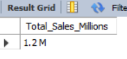 

  2. Average Sales: The average revenue per sale.
```sql
SELECT 
	ROUND(AVG(Total_Sales), 0) AS Avg_Sales
FROM blinkit_data;
```
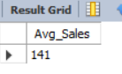 
  
  3. Number of Items: The total count of different items sold.
```sql
SELECT 
	COUNT(*) AS Number_Of_Items
FROM blinkit_data;
```
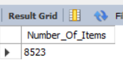 
  
  4. Average Rating: The average customer rating for items sold.
```sql
SELECT 
	ROUND(AVG(Rating), 2) AS Avg_Rating
FROM blinkit_data
```
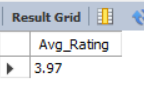 

## :point_right: Granular Requirements
1. Total Sales by Fat Content:
Objective: Analyze the impact of fat content on total sales.
Additional KPI Metrics: Assess how other KPIs (Average Sales, Number of Items, Average Rating) vary with fat content.
```sql
SELECT 
	Item_Fat_Content,
    CONCAT(ROUND(SUM(Total_Sales) / 100000, 2), ' L') AS Total_Sales_Lakhs,
    ROUND(AVG(Total_Sales), 1) AS Avg_Sales,
    COUNT(*) AS Number_Of_Items, 
    ROUND(AVG(Rating), 2) AS Avg_Rating
FROM blinkit_data
GROUP BY Item_Fat_Content
ORDER BY Total_Sales_Lakhs DESC; 
```
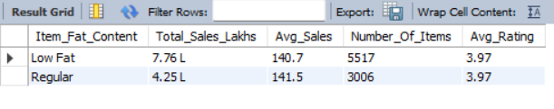 

2. Total Sales by Item Type:
Objective: Identify the performance of different item types in terms of total sales.
Additional KPI Metrics: Assess how other KPIs (Average Sales, Number of Items, Average Rating) vary with fat content.
```sql
SELECT 
	Item_Type,
    ROUND(SUM(Total_Sales), 1) AS Total_Sales,
    ROUND(AVG(Total_Sales), 1) AS Avg_Sales,
    COUNT(*) AS Number_Of_Items, 
    ROUND(AVG(Rating), 2) AS Avg_Rating
FROM blinkit_data
GROUP BY Item_Type
ORDER BY Total_Sales DESC
```
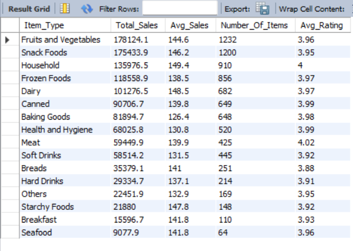 

3. Fat Content by Outlet for Total Sales:
Objective: Compare total sales across different outlets segmented by fat content.
Additional KPI Metrics: Assess how other KPIs (Average Sales, Number of Items, Average Rating) vary with fat content. 
```sql
SELECT 
    Outlet_Location_Type,
    ROUND(SUM(CASE 
			WHEN Item_Fat_Content = 'Low Fat' 
            THEN Total_Sales 
            ELSE 0 
		END), 2) AS `Low Fat Sales`,
    ROUND(SUM(CASE 
			WHEN Item_Fat_Content = 'Regular' 
            THEN Total_Sales 
            ELSE 0 
		END), 2) AS `Regular Sales`
FROM blinkit_data
GROUP BY Outlet_Location_Type
ORDER BY Outlet_Location_Type;
```
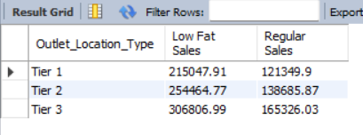 

4. Total Sales by Outlet Establishment:
Objective: Evaluate how the age or type of outlet establishment influences total sales.
```sql
SELECT 
	Outlet_Establishment_Year,
    CONCAT(ROUND(SUM(Total_Sales) / 1000, 2), ' K') AS Total_Sales_Thousands
FROM blinkit_data
GROUP BY Outlet_Establishment_Year
ORDER BY Outlet_Establishment_Year ASC; 
```
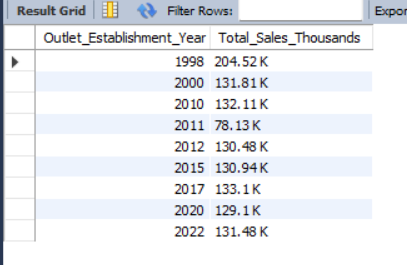 

5. Percentage of Sales by Outlet Size:
Objective: Analyze the correlation between outlet size and total sales.
```sql
SELECT 
    Outlet_Size, 
    ROUND(SUM(Total_Sales) ,2) AS Total_Sales,
    ROUND(
		SUM(Total_Sales) * 100.0 / (SELECT SUM(Total_Sales) FROM blinkit_data), 
        2) AS Sales_Percentage
FROM blinkit_data
GROUP BY Outlet_Size
ORDER BY Total_Sales DESC;
```
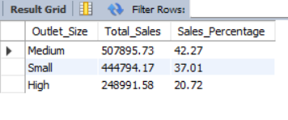 

6. Sales by Outlet Location
Objective: Assess the geographic distribution of sales across different locations.
```sql
SELECT 
	Outlet_Location_Type,
    ROUND(SUM(Total_Sales), 1) AS Total_Sales,
    ROUND(
		SUM(Total_Sales) * 100.0 / (SELECT SUM(Total_Sales) FROM blinkit_data), 
        2) AS Sales_Percentage,
    ROUND(AVG(Total_Sales), 1) AS Avg_Sales,
    COUNT(*) AS Number_Of_Items, 
    ROUND(AVG(Rating), 2) AS Avg_Rating
FROM blinkit_data
GROUP BY Outlet_Location_Type
ORDER BY Total_Sales DESC
```
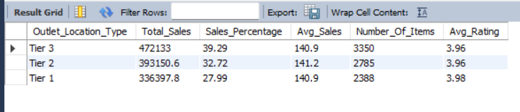 

7. All Metrics by Outlet Type:
Objective: Provide a comprehensive view of all key metrics (Total Sales, Average Sales, Number of Items, Average Rating) broken down by different outlet types.
```sql
SELECT 
	Outlet_Type,
    ROUND(SUM(Total_Sales), 1) AS Total_Sales,
    ROUND(SUM(Total_Sales) * 100 / (SELECT SUM(Total_Sales) FROM blinkit_data), 2) AS Sales_Percentage,
    ROUND(AVG(Total_Sales), 1) AS Avg_Sales,
    COUNT(*) AS Number_Of_Items, 
    ROUND(AVG(Rating), 2) AS Avg_Rating
FROM blinkit_data
GROUP BY Outlet_Type
ORDER BY Total_Sales DESC
```
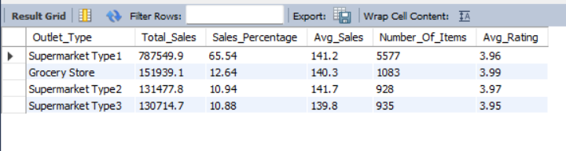 

## :muscle: MySQL
  
This is a guided project from [@Swapnjeet S](https://www.youtube.com/@datatutorials1) Youtube Channel
